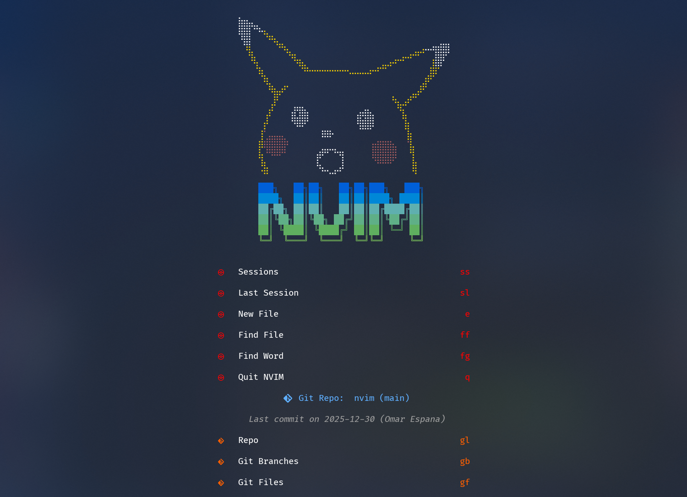

# My nvim.config

## Style

- Tokyo Night (moon, transparent)
- Alpha dashboard with custom Pikachu header and git info
- Smear cursor, noice UI, snacks
- Lualine, barbar tabs, sidebar
- Indent guides, deadcolumn, inline diagnostics
- Colorizer, todo-comments, marks

## Language Support

- **Python** — pyright, pylsp, ruff, black, debugpy
- **Go** — gopls, goimports, delve
- **TypeScript / JavaScript** — ts_ls, vtsls, eslint, prettier
- **Vue** — vue_ls, eslint_d, prettier
- **Svelte** — svelte, eslint_d, prettier
- **HTML / CSS / SCSS** — emmet, tailwindcss, css_variables, prettier
- **Lua** — lua_ls, stylua
- **GraphQL / JSON / YAML / SQL** — dedicated LSPs and formatters
- **Shell** — bashls, shellcheck, shfmt

## Features

- Telescope + fzf for fuzzy finding everything
- Treesitter with textobjects, context, and repeatable moves
- Trouble for diagnostics, quickfix, and symbol navigation
- Lazygit, gitsigns, diffview, git-conflict
- DAP debugging (Python, Go, Lua, Bash)
- Yazi file manager
- Tmux navigation
- Session management (auto-session)
- Obsidian for notes
- Surround, autopairs, mini.ai
- Which-key + precognition for keybind hints
- Cheatsheet, quickfix list, image preview
- A duck that follows your cursor

## AI

- GitHub Copilot (inline completions)
- OpenCode (chat, ask, actions)
